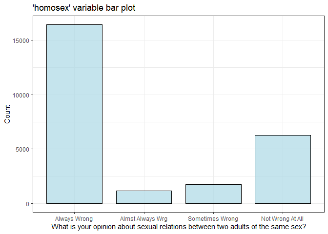
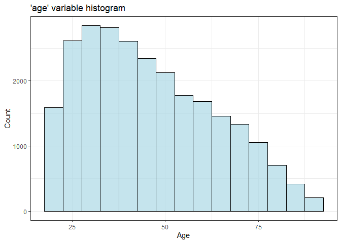
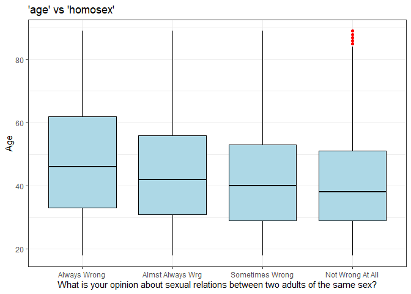
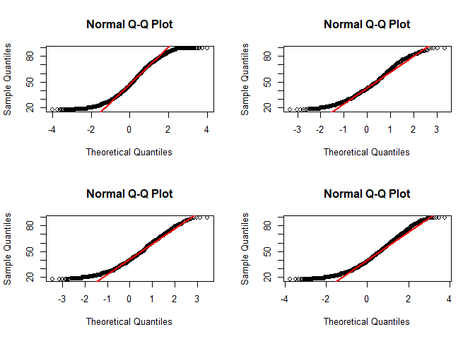
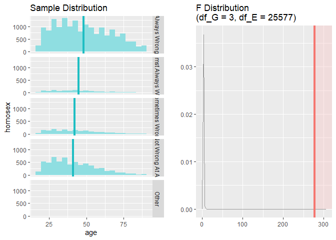

Statistical inference with the GSS data
================

## Setup

### Load packages

``` r
library(ggplot2)
library(dplyr)
library(statsr)
```

### Load data

``` r
load("gss.Rdata")
```

-----

## Part 1: Data

According to the ICPSR Codebook (Appenidx A), different sampling methods
were used during different years of the survey. A full random sample was
used during the years 1977, 1978, 1980 and 1982-2012. For the rest of
the years either some modified version of random sampling was used, or a
mixture of one-half random and one-half block quota sampling was used,
making these samples have less merit compared to the ones were random
sampling was used.

This means that the type of study conducted was an observational study,
therefore only correlation can be infered. To establish causation we
would need to have random assignment to control and experimental groups
which clearly is not the case here. Please note that the results that
come from the years were full random sampling was used are more reliable
than the rest. Furthermore the results can be generalized to the
population of the study,

The population under study here consists of all noninstitutionalized,
English and Spanish speaking persons 18 years of age or older, living in
the United States.

Please note that up until 2006 the GSS only sampled English speakers.
After 2006 Spanish speakers (who form the majority of non-English
speakers) were also included. This tells us that the population to which
we can generalize the results of our statistical analysis is slightly
different before 2007 and starting from 2007. Before 2007 the population
of our study includes English speaking noninstitutionalized adults (18+)
living in the United States, after 2007 this changes to English and
Spanish speaking noninstitutionalized adults (18+) living in the United
States.

-----

## Part 2: Research question

*During the 20 years from 1992 to 2012, is there any correlation between
between the responders’ opinion on homosexual sexual relations and their
age?*

It seems to be the case that in general older people are more
conservative while younger people more liberal. I wonder if this “common
belief” is reflected in people’s opinion about same sex relationships.

The relevant variables for this question and their description are the
following two:

`age`: responders age

`homosex`: “What is your opinion about sexual relations between two
adults of the same sex?”

-----

## Part 3: Exploratory data analysis

First we isolate the relevant variables and remove NAs. Note that I
choose to only use data from 1982 onward because they are the most
reliable ones since it was after 1981 that the GSS used full random
sampling for their surveys.

``` r
gss_age_homo <- gss %>%
  filter(year >= 1982, !is.na(homosex), !is.na(age)) %>%
  select(homosex, age) 
```

We now provide summary statistics and graphs for each relevant variable:

``` r
ggplot(gss_age_homo, aes(homosex)) +
  geom_bar(width = 0.8,
           color = "black",
           size = 0.5,
           alpha = 0.7,
           fill = "lightblue") + 
  theme_bw() +
  labs(x = "What is your opinion about sexual relations between two adults of the same sex?",
       y = "Count",
       title  = "'homosex' variable bar plot")
```

<!-- -->

``` r
summary(gss_age_homo$homosex)
```

    ##     Always Wrong Almst Always Wrg  Sometimes Wrong Not Wrong At All 
    ##            16434             1154             1713             6280 
    ##            Other 
    ##                0

We can see that most people in this sample think that sexual relations
between homosexuals are “always wrong”. People that believe that they
are “not wrong at all” are the second largest group, although
significanlty less than those who think they are always wrong. The
people who believe that they are “almost always wrong” and “sometimes
wrong” are very few compared to the other two categories.

``` r
ggplot(gss_age_homo, aes(age)) + 
  geom_histogram(binwidth = 5,
                 color = "black",
                 alpha = 0.7,
                 fill = "lightblue") +
  theme_bw() + 
  labs(x = "Age",
       y = "Count",
       title  = "'age' variable histogram")
```

<!-- -->

``` r
summary(gss_age_homo$age)
```

    ##    Min. 1st Qu.  Median    Mean 3rd Qu.    Max. 
    ##   18.00   31.00   43.00   45.87   59.00   89.00

``` r
quantile(gss_age_homo$age, probs = (1:10)*0.1)
```

    ##  10%  20%  30%  40%  50%  60%  70%  80%  90% 100% 
    ##   24   29   34   38   43   49   55   63   72   89

We see that the distribution of ages is relatively right-skewed, with a
median of \(43\). We see that \(Q_{1} = 31\) which means that the bottom
\(25\%\) of the sampled people are below \(32\) years of age. Actually
we can see that only \(10\%\) of the sampled people are below or equal
to \(24\) years old which means that there is a slight
underrepresentation of young people in this sample. From the
aforementioned \(Q_{1}\) and \(Q_{3}\) we can see that the middle
\(50\%\) of the observations are people aged \(32-58\).

To get a first look at our research question, we can create the
following plot:

``` r
ggplot(gss_age_homo, aes(x = homosex, y = age)) + 
  geom_boxplot(outlier.colour = "red",
               fill = "lightblue",
               color = "black") + 
  theme_bw() + 
  labs(x = "What is your opinion about sexual relations between two adults of the same sex?",
       y = "Age",
       title = "'age' vs 'homosex'")
```

<!-- -->

From the above plot we see that there seems to be a difference in median
age between people who view homosexual realtions are “always wrong”
versus “not wrong at all”, more specifically a decrease. This though is
just a claim we make by looking at the above box plots, if we want to be
sure about our observation we need to apply some inference method, which
we do in the next section.

-----

## Part 4: Inference

To answer the posed research question we will use ANOVA, since we want
to compare the mean age between the different groups formed by the
levels of the `homosex` categorical variable (which has more than two
levels, hence ANOVA). The hypotheses for our ANOVA test are:

\[H_{0}: \mu_{always} = \mu_{almost \, always} = \mu_{sometimes} = \mu_{not \, at \, all} \\ H_{A}: \text{At least one pair of means is different from the rest.}\]

We now need to check the conditions for ANOVA:

1.  Independence: Since there was random sampling used the observations
    are independent within groups and since they are unpaired they are
    also independent between groups.
2.  Approximate normality: To a degree, we can say it is satisfied,
    although not perfectly. See Comment below normal probability plots.
3.  Equal variance: This condition is also satisfied as we can see from
    the “‘age’ vs ‘homosex’” plot above.

<!-- end list -->

``` r
# Isolate the within groups observations in different dfs
normal_plot_always <- gss_age_homo[gss_age_homo$homosex== "Always Wrong",]
normal_plot_almost <- gss_age_homo[gss_age_homo$homosex== "Almst Always Wrg",]
normal_plot_sometimes <- gss_age_homo[gss_age_homo$homosex== "Sometimes Wrong",]
normal_plot_not <- gss_age_homo[gss_age_homo$homosex== "Not Wrong At All",]

# Plot normal plots of 'age' variable within each gruop
par(mfrow=c(2,2))
qqnorm(normal_plot_always$age)
qqline(normal_plot_always$age, col = "red", lwd = 2)

qqnorm(normal_plot_almost$age)
qqline(normal_plot_almost$age, col = "red", lwd = 2)

qqnorm(normal_plot_sometimes$age)
qqline(normal_plot_sometimes$age, col = "red", lwd = 2)

qqnorm(normal_plot_not$age)
qqline(normal_plot_not$age, col = "red", lwd = 2)
```

<!-- -->

*Remark:* If we were to be strict with our conditions, we see that the
normality condition is not satisfied very well since the above normal
plots point at the fact that the distribution of the `age` variable
within each group of `homosex` is right-skewed to varying degrees.
However, since ANOVA tolerates violations to its normality condition
rather well and the none of the above normal plots point to an extremely
skewed distribution, I choose to proceed with ANOVA.

``` r
# Perform ANOVA
inference(y = age, x = homosex, data = gss_age_homo, statistic = "mean", type = "ht", alternative = "greater", 
          method = "theoretical", sig_level = 0.05)
```

    ## Response variable: numerical
    ## Explanatory variable: categorical (5 levels) 
    ## n_Always Wrong = 16434, y_bar_Always Wrong = 48.1384, s_Always Wrong = 18.1985
    ## n_Almst Always Wrg = 1154, y_bar_Almst Always Wrg = 44.7972, s_Almst Always Wrg = 17.1104
    ## n_Sometimes Wrong = 1713, y_bar_Sometimes Wrong = 42.2493, s_Sometimes Wrong = 15.861
    ## n_Not Wrong At All = 6280, y_bar_Not Wrong At All = 41.1318, s_Not Wrong At All = 15.0977
    ## n_Other = NA, y_bar_Other = NA, s_Other = NA
    ## 
    ## ANOVA:
    ##              df       Sum_Sq    Mean_Sq        F  p_value
    ## homosex       3  249337.1168 83112.3723 278.1742 < 0.0001
    ## Residuals 25577 7641848.0093   298.7781                  
    ## Total     25580 7891185.1261                             
    ## 
    ## Pairwise tests - t tests with pooled SD:
    ## # A tibble: 6 x 3
    ##   group1           group2             p.value
    ##   <chr>            <chr>                <dbl>
    ## 1 Almst Always Wrg Always Wrong     2.23e- 10
    ## 2 Sometimes Wrong  Always Wrong     6.42e- 41
    ## 3 Not Wrong At All Always Wrong     4.74e-162
    ## 4 Sometimes Wrong  Almst Always Wrg 1.09e-  4
    ## 5 Not Wrong At All Almst Always Wrg 3.64e- 11
    ## 6 Not Wrong At All Sometimes Wrong  1.77e-  2

    ## Warning: Removed 1 rows containing missing values (geom_vline).

<!-- -->

We see that the ANOVA output is statistically significant (very small
p-value: p-value \< 0.0001). This means that the probability of
obtaining at least as large a ratio between the “between” and “within”
group variabilities as the ones we obtained given that all the means are
equal is really small. Therefore we reject the null hypothesis and
conclude that there is significant evidence that at least one pair of
means of ages of the noninstitutionalized adults (18+) living in the
United States is different from the rest.

Given the statistically significant ANOVA reslut, we now need to proceed
with multiple comparisons (or pairwise t-tests), i.e. perform t-tests to
all the possible pair of means we can have. These t-tests are not
typical but they are slightly modified (using the Bonferroni correction
for the significance level for example) to correct for the increase in
the Type I error rate that occurs when doing multiple comparisons.

From the above output we see that the only non-significant difference in
means is that between \(\mu_{not \, at \, all}\) and
\(\mu_{sometimes}\). Therefore we have:

| Opinion on same sex relations | mean `age`                         |
| ----------------------------- | ---------------------------------- |
| “Always Wrong”                | \(\mu_{always} = 48.14\)           |
| “Almost Always Wrong”         | \(\mu_{almost \, always} = 44.8\)  |
| “Sometimes Wrong”             | \(\mu_{sometimes} = 42.25\)        |
| “Not Wrong At All”            | \(\mu_{not \, at \, all} = 41.13\) |

We thus conclude that there is a correlation between age and opinion on
same sex relations and more specifically the mean age of people that
find these relationships wrong is greater than those who do not find
them wrong at all or find them wrong sometimes.

Finally, we should mention that we cannot calculate a Confidence
Interval for this particular research question since it does not make
sense to define a Confidence Interval in this context.
